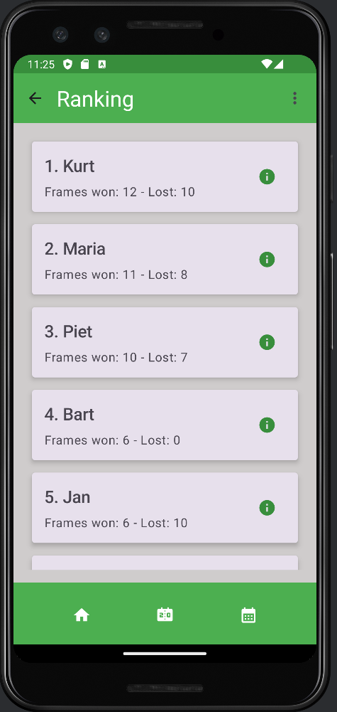

# Dimitri Valckenier
## Mobile App Development: Android (TIAO)
## Academic year 2023-2024

This repository contains the code for the Android app I developed for the course "Mobile App Development: Android" at HoGent. 
The app is designed to track billiard scores and allows users to register match results.

### Features
The app is composed of the following screens:
- **Start screen**: A screen with a welcome message. 
- **Scoreboard screen**: Displays the current ranking of the players in the competition. The user can open a dialog to show the details of a player via the icon button.
- **Playingdays screen**: Shows a list of the playing days in the competition. The user can use the icon buttons to edit a playingday or navigate to the matches of a playingday.
- **Matches screen**: Lists the matches for a selected playing day.
- **Score registration screen**: A dialog to enter or edit the scores of a match.
- **Dark mode**: The app supports a dark mode toggle in the settings.

### Endpoints
The app communicates with a REST API to fetch and update data. The API is hosted on Render and is used for a billiard competition with friends.
The app interacts with the following API endpoints:

- **GET Players with ranking**  
  Endpoint: `https://biljart-webservice.onrender.com/api/season/android`  
  Description: Retrieves a list of players with their rankings for the Android season.

- **GET Playingdays**  
  Endpoint: `https://biljart-webservice.onrender.com/api/playingday/android`  
  Description: Retrieves a list of playing days for the Android season.

- **GET Matches of a playingday**  
  Endpoint: `https://biljart-webservice.onrender.com/api/match/playingday?playingday_id=34`  
  Description: Retrieves the list of matches for a specific playing day.

- **PUT Update a playingday**  
  Endpoint: `https://biljart-webservice.onrender.com/api/playingday/updateandroid?playingday_id=35&is_finished=true`  
  Description: Updates the status of a playingday (e.g., marking it as finished).

- **PUT Update a match**  
  Endpoint: `https://biljart-webservice.onrender.com/api/match/updateandroid?match_id=279&player1FramesWon=6&player2FramesWon=5`  
  Description: Updates the scores of a specific match.
  **Validation rules**:
    - **Non-negative scores**: The scores entered for both players must be non-negative integers. This means that the scores cannot be negative or left blank.
    - **Valid number input**: Only numerical values are allowed. Any non-numeric input is not permitted, and the fields will only accept digits.
    - **Winning condition**: A match is considered valid if one player has won 6 frames. This means that at least one of the players must have a score of 6. If neither player has won 6 frames, the only valid condition is that both players have a score of 0 (indicating that the match has not yet been played or the scores are reset).
    - **Mutually exclusive winning**: Both players cannot have a score of 6 or higher simultaneously. Only one player should reach the winning condition of 6 frames won, while the other should have a lower score.

### Screenshots

### Additional Information

- **Technologies**: The app is built with Kotlin and follows the MVVM architecture pattern. It utilizes Jetpack Compose for the UI, Retrofit for networking, and ViewModels for state management.

- **Testing**: The project includes unit tests for ViewModels and UI tests for the main composables using the Android Testing Library.

- **Project structure**: The app is modularized into separate components, each responsible for a specific feature or part of the UI.

- **User interface**: The app is designed with Material Design M3 principles in mind, ensuring a modern and consistent look and feel.

### Installation

To run this app:

1. Clone the repository.
2. Open the project in Android Studio.
3. Build and run the app on an Android device or emulator.